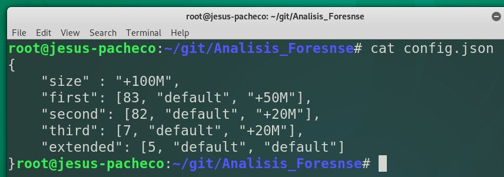

# Analisis_Foresnse

Programas para el curso de Análisis Forense

## Descripción del Programa

	Este programa se encarga de realizar particiones de una
	unidad de manera automática, debe ser ejecutado con python3
	y recibe dos argumentos de entrada el primero es la unidad
	que se desea particionar, esta puede existir o en su defecto
	puede no existir y el programa la creara, el segundo es un
	archivo json que contendra toda la configuracion del programa
	ahi se especifica el tamaño de la undidad y las caracteristicas
	de las cuatro particiones a crear.

	Ejemplo de ejecucion:
	
		python3 fdisk_r4.py unidad_C config.json

	
	
	
	
	
